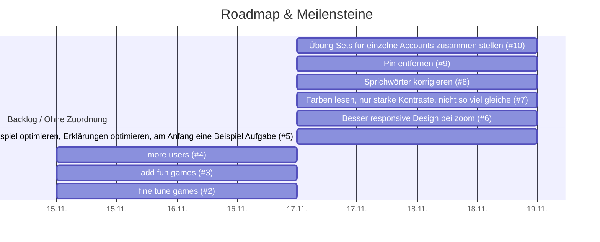

# 📅 Projekt-Plan

```mermaid
gantt
    dateFormat  YYYY-MM-DD
    axisFormat  %d.%m.
    title Roadmap & Meilensteine
    section Backlog / Ohne Zuordnung
    Übung Sets für einzelne Accounts zusammen stellen (#10) : 2026-11-17, 2d
    Pin entfernen (#9) : 2026-11-17, 2d
    Sprichwörter korrigieren (#8) : 2026-11-17, 2d
    Farben lesen, nur starke Kontraste, nicht so viel gleiche (#7) : 2026-11-17, 2d
    Besser responsive Design bei zoom (#6) : 2026-11-17, 2d
    Mirror spiel optimieren, Erklärungen optimieren, am Anfang eine Beispiel Aufgabe (#5) : 2026-11-17, 2d
    more users (#4) : 2026-11-15, 2d
    add fun games (#3) : 2026-11-15, 2d
    fine tune games (#2) : 2026-11-15, 2d
```